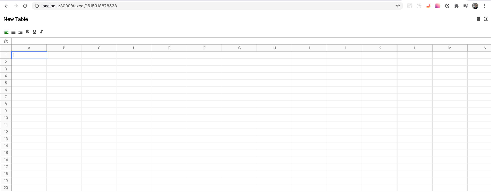
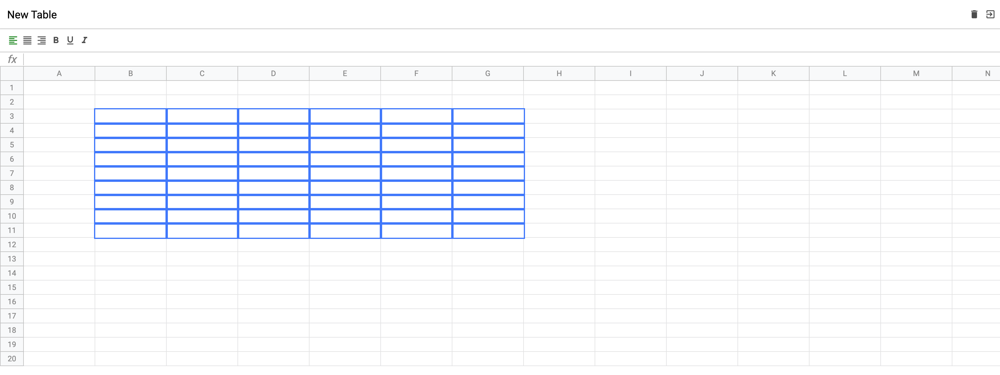
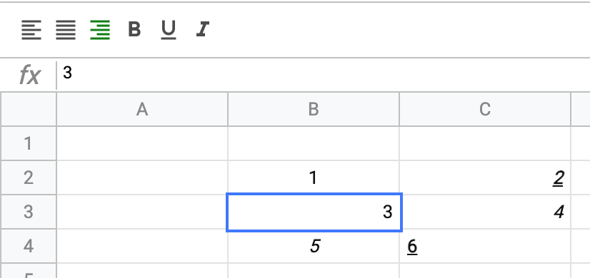
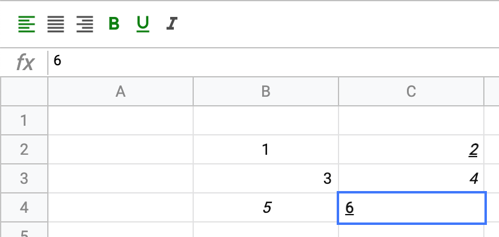

# Pure JS Excel app with basic functionality
_Project purpose: build an SPA without any existed UI frameworks and/or libraries. Create custom UI framework from scratch, as well as Redux-like state manager, app observer etc._

## Functionality
+ Creating new table
+ Edit new table name and cells
+ Customize cells with styles via buttons (text align, font weight etc.)
+ Deleteing a table
+ Routing

## Technologies

+ JS
+ SASS
+ Webpack
+ Babel
+ Eslint
+ Jest

### Home page without existing tables

### Home page with existing tables

### New table page

### Multiple selection

### Styled cells

